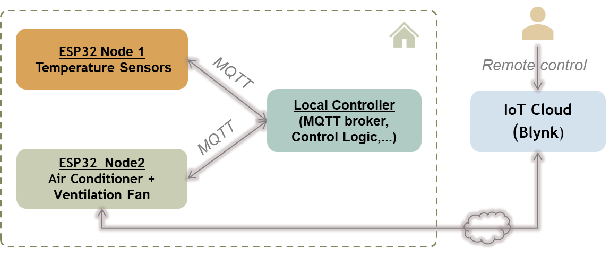

# IoT Smart Home: Fan-AC Controller

## Miêu tả hệ thống



**1) Hai bo mạch ESP32**

Node 1: "ESP32 Cảm biến" đọc dữ liệu từ hai cảm biến nhiệt độ (bên trong phòng và không khí tự nhiên bên ngoài), sau đó gửi các giá trị đo được lên MQTT topic đặt trên máy WSL. Node 1 không cần gửi quá dầy đặc liên tục, thay vào đó cứ n (ví dụ 10) giây 1 một lần.

Node 2: ESP32 Điều khiển" (còn gọi là Chấp hành), nó đăng ký (subscribe) topic nhận lệnh từ MQTT, và điều khiển động cơ và rơ-le dựa trên các tín hiệu/lệnh điều khiển nhận được. Ngoài ra nó cho phép Điều khiển thủ công qua Blynk với Blynk.Edgent được tích hợp. Nếu "auto mode" bị chọn tắt (từ Blynk) thì node bỏ qua các lệnh gửi từ Local controller, mà thực thi theo lệnh điều khiển thủ công từ Blynk - mặc định "auto mode" is ON)

*Ghi chú: Sẽ rất tốt nếu hai bo mạch có màn hình hiển thị gì đó cho hấp dẫn*

**2) Local controller** 

Local controller đóng vai trò máy chủ cục bộ (dùng WSL Ubuntu trên laptop mô phỏng), nó cung cấp một MQTT broker (Mosquitto), đồng thời  là "bộ não" nơi control logic được áp dụng, và là nơi điều phối hoạt động tại chỗ. Tại đây, logic điều khiển (có thể đơn giản hóa viết bằng Python) đọc và xử lý dữ liệu cảm biến (gửi từ ESP32 node 1 qua MQTT), đưa ra quyết định, cuối cùng gửi lệnh điều khiển đến ESP32 điều khiển (node 2) qua MQTT. Tốt hơn nữa, nó có thể được lập trình để điều khiển một cách hợp lý để bảo vệ các thiết bị đồng thời tiết kiệm xử lý tính toán.

**3) IoT Cloud (Blynk)**

Được áp dụng cho ESP32 Điều khiển (node 2), cho phép người dùng bật/tắt thủ công động cơ và rơ-le. Ngoài ra, nó cũng giúp thiết lập tham số cấu hình MQTT (ví dụ ip, host của MQTT broker là gì) cho ESP32 Điều khiển sử dụng.

## Cấu trúc các MQTT messages (JSON)

**1) Message gửi từ ESP32 node 1 tới Local Controller**

```json
{
  "device_id": "esp32_sensor_01",
  "interval_s": 10,
  "unit": "C",
  "ts": 1736881010,
  "temperatures": {
    "inside": {
      "sensor_id": "temp_inside_1",
      "value": 26.1
    },
    "outside": {
      "sensor_id": "temp_outside_1",
      "value": 22.0
    }
  }
}
```


**2) Message gửi từ Local Controller tới node 2 cho các trường hợp**

```json
{
  "cmd_id": 1042,
  "source": "local",
  "mode_request": "auto",
  "relay": 0,
  "fan": 1,
  "ts": 1736882000,
  "reason": "inside>26 and outside<=22 -> prefer_fan"
}
```

```json
{
  "cmd_id": 1044,
  "source": "local",
  "mode_request": "auto",
  "relay": 0,
  "fan": 0,
  "ts": 1736882060,
  "reason": "inside<=threshold -> idle"
}
```

```json
{
  "cmd_id": 88,
  "source": "blynk",
  "mode_request": "manual",
  "relay": 1,
  "fan": 0,
  "manual_for_s": 600,
  "ts": 1736882100
}
```

## Local Controller

Chương trình Local Controller được viết bằng Python, chạy trên máy chủ cục bộ (WSL Ubuntu) và đóng vai trò như "bộ não" của dự án MSE IoT trong phạm vi rút gọn:

```
  ESP32 cảm biến  --->  MQTT  --->  Python Controller  --->  MQTT  --->  ESP32 Chấp hành
   (nhiệt độ trong/ngoài)                                (điều khiển relay + quạt)
```

Chương trình đọc các bản ghi nhiệt độ từ node cảm biến, áp dụng một chính sách điều khiển kiểu kiểu "thermostat"", và publish lệnh điều khiển tới một ESP32 Chấp hành để điều khiển:
  - Relay cấp nguồn cho điều hòa (relay: 0/1)
  - Quạt thông gió (fan: 0/1)

**Chính sách điều khiển được định nghĩa như sau:**

a) Các quy tắc cốt lõi:

Hysteresis band (giúp tránh bật/tắt liên tục khi nhiệt độ dao động quanh ngưỡng):
  * Chỉ bật làm mát/thông gió khi nhiệt độ trong nhà >= ON_THRESHOLD_C
  * Chỉ tắt (về idle) khi nhiệt độ trong nhà <= OFF_THRESHOLD_C

  Ví dụ: ON_THRESHOLD_C  = 26.0, OFF_THRESHOLD_C = 25.7 (nếu HYSTERESIS_C = 0.3)

Lựa chọn trạng thái "bật" (ON) khi nhiệt độ trong nhà >= ON_THRESHOLD_C:
  * Nếu trong nhà "rất nóng" (>= ON_THRESHOLD_C + ALL_DELTA_C) -> chọn "all" (bật cả điều hòa + quạt)
  * Nếu không, và nhiệt độ ngoài trời <= OUTSIDE_COOL_C -> chọn "fan" (ưu tiên thông gió)
  * Ngược lại -> chọn "ac"

b) Các quy tắc nâng cấp theo thời gian (escalation):

Nếu quạt đã chạy trong FAN_GRACE_S mà nhiệt độ vẫn >= ngưỡng ON -> chuyển sang "ac"

Nếu điều hòa đã chạy trong AC_GRACE_S mà nhiệt độ vẫn >= ngưỡng ON -> chuyển sang "all". Nhưng chỉ khi nhiệt độ ngoài trời < nhiệt độ trong nhà (khi đó thông gió mới thực sự giúp thoát nhiệt)

c) Quy tắc chống bật/tắt quá nhanh (anti-short-cycling, thời gian chạy tối thiểu):

Khi bộ điều khiển đã bật một trạng thái khác "idle" (fan/ac/all), nó sẽ không cho phép chuyển về "idle" cho đến khi đã trôi qua MIN_ON_RUNTIME_S giây.

Tuy nhiên, việc chuyển đổi giữa các trạng thái đang bật (fan <-> ac <-> all) vẫn được phép.

---

### Tiến độ và tình trạng công việc

1) Xác định yêu cầu cơ bản (baseline), miêu tả và thiết kế hệ thống kèm tài liệu --> DONE (S. Hùng)

2) Giải pháp sử dụng WSL (Ubuntu) của Windows để cài một MQTT broker. Đồng thời định nghĩa các message giao tiếp giữa các thành phần MQTT  --> DONE (S. Hùng)

3) Viết Python code cho  "Local Controller" - chịu trách nhiệm chính về logic điều khiển và tương tác với 2 ESP32 nodes qua MQTT --> DONE (S. Hùng)

4) Thiết kế Blynk Dashboard cho Điều khiển thủ công --> DONE (S. Hùng)

5) Code nhúng mẫu cho IoT CLoud Blynk, điều khiển thủ công qua Internet. Đồng thời tích hợp chức năng đọc các lệnh điều khiển qua MQTT vào cùng một code. Lưu ý cái này chỉ tập trung vào Blynk và MQTT - không bao gồm code cho việc điều khiển các thiết bị chấp hành (quạt thông gió, điều hòa) --> DONE, check it out here [ESP32-Blynk-Local-MQTT](ESP32-Blynk-Local-MQTT) (S. Hùng)

6) Build node 1 --> Chinh + Hưng

7) Build node 2 --> Chinh hoàn thiện nốt (Regarding to Blynk và MQTT code example, refer to[ESP32-Blynk-Local-MQTT](ESP32-Blynk-Local-MQTT) by S. Hung)

8) Triển khai thành đầy đủ hệ thống (ghép nối các thành phần lại) để sẵn sàng demo --> Cần thiết lập trên máy tính của một ai đó (?) để làm demo (máy của 1 bạn khác, ?, để backup)

9) Báo cáo nhóm --> Hưng

10) Slide --> chưa làm, S. Hùng

FINISH